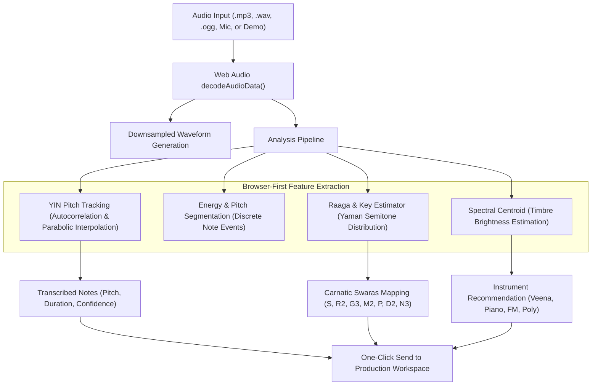
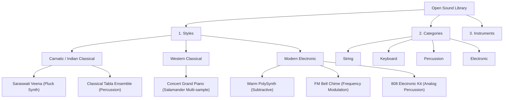

# D3 MusiQ 🎵

> **An open, hands-on music creation workspace bridging Western music theory and Carnatic raagas.**
> *Empowering musicians to manually layer notes, explore modal relationships, and compose in the browser — not full AI black-box song generation.*

---

## 🌟 Vision & Philosophy

Modern music tools often trend toward one-button "generate a whole song" AI wrappers that remove human creative agency. **D3 MusiQ takes the opposite path:**
- **Human-in-the-loop artistry**: You select, place, layer, and audition each note manually.
- **Harmonic bridge**: Seamlessly connects Indian Classical Carnatic raagas (starting with **Raag Yaman / Mechakalyani Mela**) with Western modes (Lydian).
- **Tactile DAW experience**: Real-time 16-step grid sequencer, polyphonic synthesis, acoustic multi-samples, and browser-first zero-install audio.
- **Reverse-Engineering & Breakdown**: Analyze recorded or uploaded audio, detect swaras and pitch contours, and send them directly to your workspace.

---

## 🚀 Quick Start

### Prerequisites
- Node.js 18+ (tested on Node 20 & 24)
- npm 9+

### Installation & Launch

```bash
# 1. Clone or navigate to the project directory
cd d3-Musiq

# 2. Install dependencies
npm install

# 3. Start the Next.js development server
npm run dev
```

Open [http://localhost:3000](http://localhost:3000) in your browser:
- Navigate to `/production` to launch the hands-on creation workspace.
- Navigate to `/breakdown` to access audio analysis and reverse engineering.

---

## 🏛️ Project Architecture

```
/workspaces/d3-Musiq
├── app/
│   ├── layout.tsx              # Dark-mode studio shell & top navigation
│   ├── page.tsx                # Home / Landing page highlighting D3 MusiQ vision
│   ├── production/
│   │   └── page.tsx            # Main hands-on production workspace
│   └── breakdown/
│       └── page.tsx            # Audio Breakdown & reverse-engineering workspace
├── components/
│   ├── AudioUnlockOverlay.tsx  # Compliant Web Audio context gesture unlock
│   ├── TransportBar.tsx        # Transport, BPM, Volume, Persistence, Voice selector
│   ├── LibraryPanel.tsx        # Hierarchical open library (Styles → Instruments → Notes/Bols)
│   └── PianoRoll.tsx           # 16-step dual-axis grid with synced playhead & multi-select
├── lib/
│   ├── audio/
│   │   └── engine.ts           # Tone.js wrapper (Synths, Sampler, Tabla, 808, Master chain)
│   ├── theory/
│   │   └── carnatic.ts         # Pure Carnatic <-> Western music theory engine
│   ├── library/
│   │   ├── types.ts            # Taxonomy data types (Styles, Categories, Instruments)
│   │   ├── instruments.ts      # Instrument catalog & sample configurations
│   │   └── library-data.ts     # Re-exports, scales catalog, and preset phrases
│   └── analysis/
│       ├── audio-analyzer.ts   # Browser-first YIN pitch extraction, onsets, raaga estimator
│       └── demo-audio.ts       # Synthetic audio generator for zero-file instant testing
└── store/
    └── useProjectStore.ts      # Minimal, serializable Zustand state with persistence & import
```

---

## 🔬 Breakdown View: Audio Analysis Pipeline (Step 3)

The **Breakdown** interface allows users to reverse-engineer audio clips into editable musical patterns:



### 1. Audio Ingestion
- **File Upload**: Drag-and-drop or browse for `.mp3`, `.wav`, `.ogg`, or `.m4a` files.
- **Microphone Capture**: Real-time 5-second voice/instrument capture via `MediaRecorder`.
- **Instant Demo Clip**: Zero-setup synthetic Raag Yaman acoustic motif generator for immediate one-click testing.

### 2. Pitch & Note Extraction (YIN Algorithm)
- High-resolution frame-by-frame fundamental frequency ($f_0$) tracking.
- Parabolic interpolation on the cumulative mean normalized difference function (CMNDF) for sub-sample accuracy.
- RMS energy gating filters out background noise and silent pauses.
- Automatic median-filtering prevents acoustic vibrato from fragmenting notes.

### 3. Raaga & Western Key Correlation
- Computes pitch-class histograms and correlates against Raag Yaman's intervals ($S, R2, G3, M2, P, D2, N3$).
- Identifies the most likely tonic ($C, D, E, F, G, A, B$) and assigns Carnatic swaras to matching frequencies.
- Outputs an overall Raag Yaman match confidence percentage (e.g. `94%`).

### 4. Instrument & Timbre Recommendation
- Calculates the spectral centroid to estimate sound brightness:
  - High centroid ($> 2800$ Hz) $\rightarrow$ FM Bell Chime
  - Mid-range transient $\rightarrow$ Saraswati Veena Pluck
  - Balanced acoustic decay $\rightarrow$ Concert Grand Piano
  - Low/warm centroid ($< 1200$ Hz) $\rightarrow$ Warm PolySynth

### 5. "Send to Production" Integration
- Quantizes continuous note start times onto the 16-step grid.
- Transposes the tonic and selects the recommended instrument.
- Navigates immediately to `/production`, where the transcribed phrase loops seamlessly.

### ⚠️ Current Analysis Limitations
- **Monophonic & Predominant Pitch Focus**: The current browser engine specializes in single-instrument lines, voice humming/singing, and clear lead motifs. Complex dense polyphony or heavy full-drum mixes may yield approximate dominant frequencies.
- **Microtonal Shruti Simplification**: Notes are quantized to the nearest 12-TET semitone for representation on the piano roll grid (continuous *gamaka* microtonal bends are planned for Step 4).

---

## 📚 Open Sound Library Taxonomy



### Supported Instruments

| Instrument | Style | Category | Engine Type | Details |
| :--- | :--- | :--- | :--- | :--- |
| **Saraswati Veena** | Carnatic | String | Acoustic Synth | Snappy attack (`0.003s`) with resonant pluck decay |
| **Classical Tabla** | Carnatic / Hindustani | Percussion | Physical Modeling | Authentic bols: `Dha`, `Dhin`, `Ge`, `Na`, `Tin`, `Ka` |
| **Concert Grand Piano** | Western Classical | Keyboard | Multi-Sampled | Lazy-loaded `Tone.Sampler` via Salamander Audio CDN |
| **Warm PolySynth** | Modern Electronic | Electronic | Subtractive Synth | Warm analog sawtooth/triangle voices with smooth filter |
| **FM Bell Chime** | Modern Electronic | Electronic | FM Synthesis | Crystalline modulation index with sparkling harmonics |
| **808 Rhythm Kit** | Modern Electronic | Percussion | Analog Percussion | Deep sub-bass kick, snappy snare, and crisp metallic hats |

---

## 🗺️ Next Steps Roadmap

- **Step 4 (Microphone & Vocal Tracking)**: Zero-latency microphone pitch pipe tuner with microtonal Carnatic shruti visualization.
- **Step 5 (Contextual AI Assistant)**: Human-guided theoretical copilot suggesting raaga-compliant continuation phrases (*sancharas*) without black-box generation.
- **Step 6 (openDAW Evaluation)**: Multi-track timeline, automation curves, and Web Audio worklet plugins.

---

## 📄 License
Open-source under the MIT License.